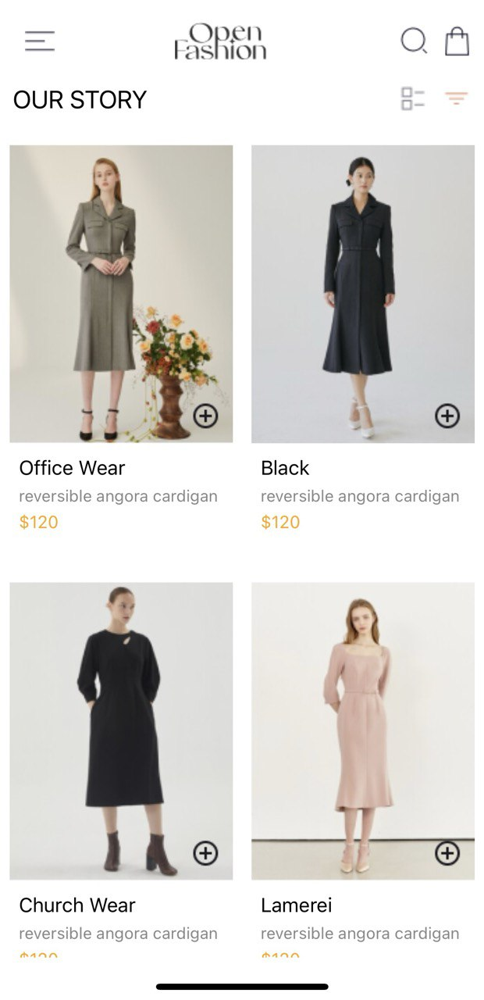
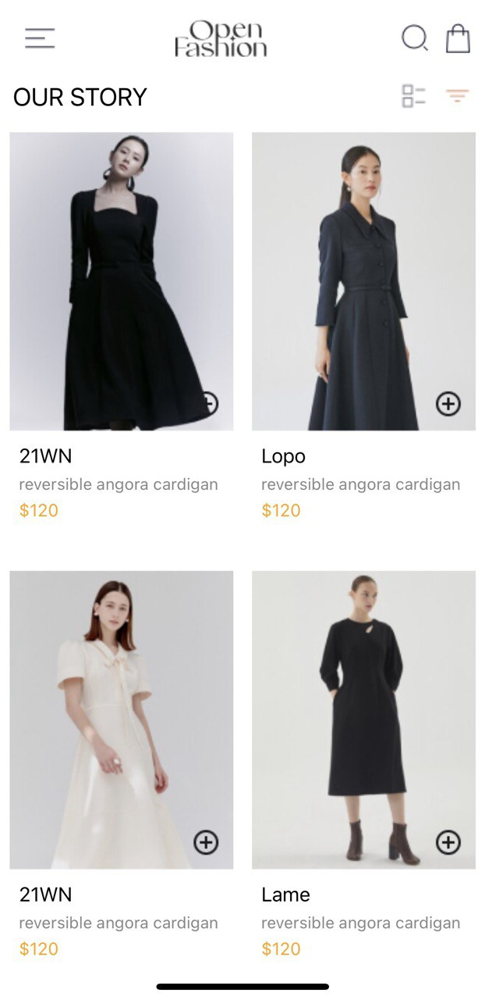
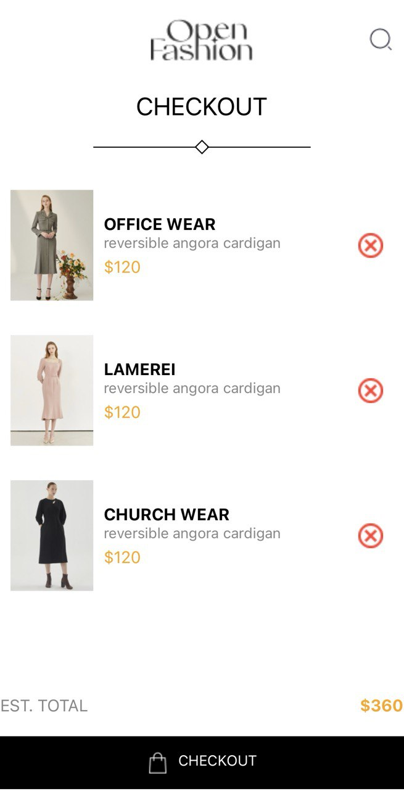

# rn-assignment6-11034645
### Shopping Mobile Application
This application is an e-commerce themed mobile application built using React Native. It is designed to manage and view cart items and proceed to checkout. The app includes features for adding and removing items from the cart, calculating total costs, and being able to view the items which were added to cart.

### Features:

- **Cart Management**: Add and remove items from the cart.
- **Total Calculation**: Dynamically calculates the total cost of items in the cart.
- **Navigation**: Allows navigation between home and cart screens.
- **Consistent Styling**: Maintains a clean and consistent design across all screens.
- **AsyncStorage**: Uses AsyncStorage to persist cart items.

### Core Components Used:

- **SafeAreaView**: Ensures content is within the safe area boundaries of a device.
- **FlatList**: Efficiently renders a large list of items.
- **TouchableOpacity**: Wraps components to make them touchable.
- **useState, useEffect**: React hooks for managing state and side effects.
- **AsyncStorage**: Provides simple, asynchronous, persistent key-value storage.

### Additional Dependencies:
- **@react-navigation/native**: Provides the navigation container for managing the navigation state.
- **@react-navigation/stack**: Provides stack-based navigation.
- **@react-native-async-storage/async-storage**: Provides asynchronous, persistent, key-value storage.

### Screenshots Of Application:

### Installation:
To run this application locally:

1. Clone this repository.
   
2. Navigate to the project directory and run `npm install` to install dependencies.
   
3. Run `npm start` to start the Metro Bundler.
   
4. Scan the QR code using the Expo Go app on your mobile device or run the application on an emulator.

### Technologies Used:

- React Native
- JavaScript
- @react-navigation/native
- @react-navigation/stack
- @react-native-async-storage/async-storage

Code Explanation:
This application consists of three main components:
App: Manages navigation between screens.
HomeScreen: Displays products and allows adding them to the cart.
Cart: Displays cart items, allows removing them, and calculates the total cost.

### Reason for Choosing AsyncStorage:

AsyncStorage was chosen for its simplicity and ease of use in storing key-value pairs, making it ideal for basic data persistence needs. Its support for asynchronous operations ensures non-blocking storage tasks, enhancing app performance. Additionally, AsyncStorage's compatibility with React Native ensures smooth integration and consistent operation across different devices and platforms. It also provides persistent storage across app sessions, which is crucial for maintaining cart state even if the app is closed and reopened.

## Student ID
11034645
